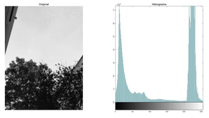
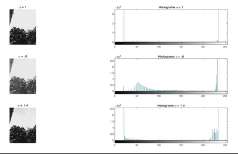
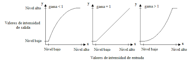

# Introducción
Se propone realizar un programa que pueda realizar diferentes pruebas de ajuste del histograma con diferentes rangos y diferentes imágenes en escala de grises y a color con la finalidad de mejorar las imágenes

## ¿Qué es el procesamiento digital de imagenes (PDI)?
PDI se puede definir como el conjunto de procesamientos que se realizan sobre una imagen digital ya sea para realizar su almacenamiento, transmisión o tratamiento.

## Lectura de imágenes en matlab
Para leer una imágen en matlab se utiliza la función <a href="https://la.mathworks.com/help/matlab/ref/imread.html"> **imread**</a> y se asigna a una variable que representara a la imágen.

<code>imagen = imread('ruta/nombre de la imágen.extensión');</code>

## MEJORAMIENTO Y RESTAURACIÓN DE UNA IMAGEN
## ¿Cuando se dice que una imagen ha sido mejorada?
* El término de mejoramiento digital de imágenes, es realmente subjetivo en el sentido de 2 o más observadores pueden tener criterios diferentes para decir si una imagen ha sido supuestamente mejorada o no
* De hecho lo que para un observador puede ser mejoramiento para otro puede ser empeoramiento

## MEJORAMIENTO DIGITAL DE IMÁGENES
- Mejor contraste
- Bordes más definidos
- Acentuación de determinadas frecuencias o datos espaciales
- Atenuación de ruido

### El histograma de una imagen
Un histograma es una imagen que nos muestra la frecuencia con la que se repiten determinados valores.

En el histograma de una imagen se combinan dos variables, una para cada eje. En el eje vertical encontramos la cantidad de pixeles. En el eje horizontal, encontramos los valores de luminosidad.

Con la función <a href="https://la.mathworks.com/help/images/ref/imhist.html?s_tid=doc_ta">imhist</a> podemos visualizar el histograma de una imagen en escala de grises, si se desea visualizar el histograma de una imagen a color, se debe realizar el histograma de cada plano, el cual saldrá en escala de grises

<code>imhist(imagen)</code>

* Nota: Cualquier modificación en el histograma de un plano de la imagen, puede reconstruir la imágen

### Manipulación del histograma
Esta técnica como las mencionadas en el <a href="https://github.com/ArturoEmmanuelToledoAguado/Transformaciones-comunes">mejoramiento digital de imágenes</a>, se emplea en el dominio espacial, es decir, se trabaja directamente sobre los pixeles de la imagen.

Las funciones de transformación de intensidad, dependen únicamente de los valores de intensidad y **no** de la posicion de los pixeles 

* Nota: Si se altera el histograma no se altera la posicion de los pixeles
* Nota: El histograma ayuda a distribuir de mejor manera las tonalidades (0 - 255), ademas muestra cual valor abunda más (contraste)

Para lograr manipular el histograma en matlab, es necesario hacer uso de la función <a href="https://la.mathworks.com/help/images/ref/imadjust.html?s_tid=doc_ta">imadjust</a> la cual aumenta el contraste de la imagen asignando los valores de la imagen de intensidad de entrada a nuevos valores de modo que, exista una mejor distribución de los datos en el histograma

<code>imcont=imadjust(img)</code>

Esta función tambien permite argumentos tales como el rango de los valores de intensidad de la imagen de entrada que se desea mapear y el rango de valores de estos a la salida

<code>imcont=imadjust(img,[low_in high_in],[low_out high_out])</code>

* Nota: Los valores están ponderados en el rango entre 0 y 1,por lo que se requiere dividir el número entre 255 ($\frac{0 - 255}{255}$)

### Gamma ($\gamma$) en imadjust
Finalmente también tenemos la opción de introducir el parámetro $\gamma$ que especifica la forma de la curva que mapea los valores de intensidad

Gamma puede ser cualquier valor entre 0 e infinito. 
  * Si $\gamma$=1 (valor predeterminado), la asignación es lineal
  * Si $\gamma$<1, la asignación se pondera hacia valores de salida más altos (más brillantes).
  * Si $\gamma$>1, la asignación se pondera hacia valores de salida más bajos (más oscuros)

<code>imcont=imadjust(img,[low_in high_in],[low_out high_out],gamma)</code>

<a href="https://github.com/ArturoEmmanuelToledoAguado/Man_Histograma">Código</a>